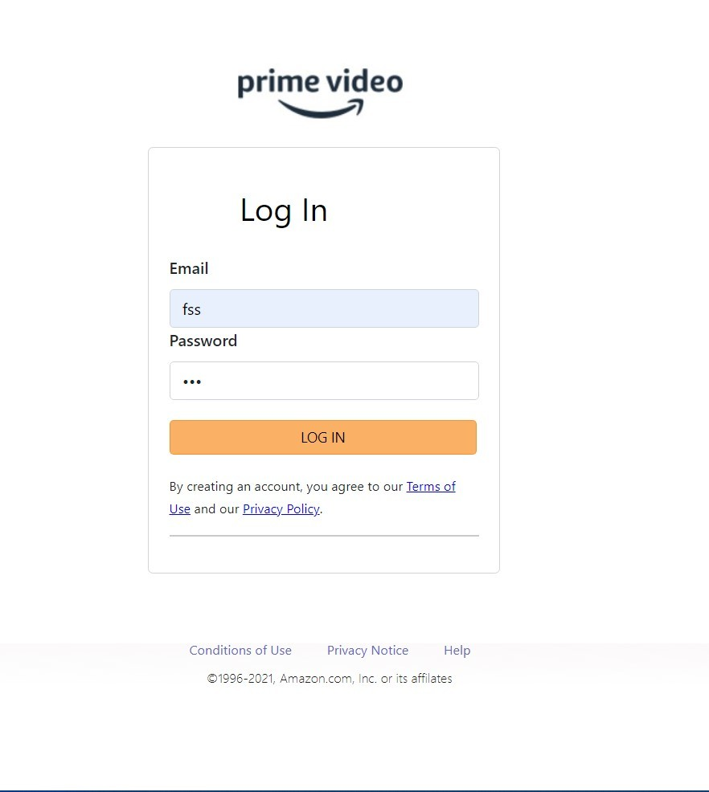

# DevSecOps Amazon Prime Clone Project

This project demonstrates a DevSecOps pipeline for an Amazon Prime clone application, incorporating various tools and practices for secure and efficient deployment.

## Project Overview


This project implements a DevSecOps pipeline for an Amazon Prime clone application. It includes continuous integration, security scanning, and deployment using both Docker containers and Kubernetes.

## Table of Contents
1. [Project Overview](#project-overview)
2. [Tools Used](#tools-used)
3. [Clone Repository](#clone-repository)
4. [Installation and Setup](#installation-and-setup)
   - [Docker Installation](#docker-installation)
   - [Kubernetes Installation](#kubernetes-installation)
   - [Jenkins Installation](#jenkins-installation)
   - [SonarQube Installation](#sonarqube-installation)
   - [Trivy Installation](#trivy-installation)
5. [CI/CD Setup](#cicd-setup)
   - [Pipeline Stages](#pipeline-stages)
   - [Security Measures](#security-measures)
   - [Jenkins Configuration](#jenkins-configuration)
   - [Jenkins Pipeline](#jenkins-pipeline)
6. [Deployment Approaches](#deployment-approaches)
   - [Docker Container Deployment](#docker-container-deployment)
   - [Kubernetes Deployment](#kubernetes-deployment)
   - [Helm Chart Deployment](#helm-chart-deployment)
7. [Monitoring and Observability](#monitoring-and-observability)
   - [Prometheus Setup](#prometheus-setup)
   - [Grafana Setup](#grafana-setup)
8. [Project Screenshots](#project-screenshots)
9. [Troubleshooting](#troubleshooting)
10. [Contributing](#contributing)
11. [License](#license)

## Tools Used

• Jenkins • Docker • Kubernetes • SonarQube • Trivy • Helm • Prometheus • Grafana • AWS EC2 • AWS ECR

## Clone Repository

To get started with this project, clone the repository using the following command:
```
git clone https://github.com/shubha21m/DevSecOps-Amazon-Prime-Clone.git
```

## Installation and Setup

### Docker Installation

1. Update your package index:
   ```
   sudo apt-get update
   ```
2. Set up Docker's `apt` repository.:
   ```
    sudo apt-get install ca-certificates curl
    sudo install -m 0755 -d /etc/apt/keyrings
    sudo curl -fsSL https://download.docker.com/linux/ubuntu/gpg -o /etc/apt/keyrings/docker.asc
    sudo chmod a+r /etc/apt/keyrings/docker.asc

    # Add the repository to Apt sources:
    echo \
    "deb [arch=$(dpkg --print-architecture) signed-by=/etc/apt/keyrings/docker.asc] https://download.docker.com/linux/ubuntu \
    $(. /etc/os-release && echo "$VERSION_CODENAME") stable" | \
    sudo tee /etc/apt/sources.list.d/docker.list > /dev/null
    sudo apt-get update
   ```
3. Install Docker:
   ```
   sudo apt-get install docker-ce docker-ce-cli containerd.io docker-buildx-plugin docker-compose-plugin
   ```
4. Verify the installation:
   ```
   docker --version
   ```

### Kubernetes Installation

Install kubectl:
   ```
   curl -LO "https://dl.k8s.io/release/$(curl -L -s https://dl.k8s.io/release/stable.txt)/bin/linux/amd64/kubectl"
   sudo install -o root -g root -m 0755 kubectl /usr/local/bin/kubectl
   ```

### Jenkins Installation

1. Install Java:
   ```
   sudo apt-get update
   sudo apt-get install openjdk-17-jre -y
   ```
2. Add Jenkins repository:
   ```
    sudo wget -O /usr/share/keyrings/jenkins-keyring.asc \
    https://pkg.jenkins.io/debian-stable/jenkins.io-2023.key
    echo "deb [signed-by=/usr/share/keyrings/jenkins-keyring.asc]" \
    https://pkg.jenkins.io/debian-stable binary/ | sudo tee \
    /etc/apt/sources.list.d/jenkins.list > /dev/null
   ```
3. Install Jenkins:
   ```
    sudo apt-get update
    sudo apt-get install jenkins -y
   ```
4. Start Jenkins service:
   ```
   sudo systemctl start jenkins
   ```

### SonarQube Installation

1. Run SonarQube using Docker:
   ```
   docker run -d --name sonarqube -p 9000:9000 sonarqube:lts-community
   ```

### Trivy Installation

1. Install Trivy:
   ```
   sudo apt-get install wget apt-transport-https gnupg lsb-release
   wget -qO - https://aquasecurity.github.io/trivy-repo/deb/public.key | sudo apt-key add -
   echo deb https://aquasecurity.github.io/trivy-repo/deb $(lsb_release -sc) main | sudo tee -a /etc/apt/sources.list.d/trivy.list
   sudo apt-get update
   sudo apt-get install trivy
   ```

## CI/CD Setup

### Pipeline Stages

1. Clean Workspace
2. Checkout from Git
3. SonarQube Analysis
4. Quality Gate
5. Install Dependencies
6. OWASP Dependency Check
7. Trivy File System Scan
8. Docker Build and Push
9. Kubernetes Deployment

### Security Measures

- SonarQube for code quality and security analysis
- OWASP Dependency Check for vulnerability scanning
- Trivy for container and file system security scanning
- Quality gates to ensure code meets security standards

### Jenkins Configuration

1. Install Necessary Plugins in Jenkins:
   - Go to Manage Jenkins → Plugins → Available Plugins
   - Install the following plugins without restart:
     - pipeline: stage view
     - SonarQube Scanner
     - NodeJs Plugin
     - Email Extension Plugin

2. Configure Sonar Scanner and NodeJS in Global Tool Configuration:
   - Go to Manage Jenkins → Tools
   - Install Sonar Scanner and NodeJs(16)
   - Click on Apply and Save

3. Configure SonarQube:
   - Create a token in SonarQube
   - In Jenkins, go to Dashboard → Manage Jenkins → Credentials → Add Secret Text
   - Add the SonarQube token
   - Click on Apply and Save

4. Create a Jenkins webhook for SonarQube

5. Install Dependency-Check Plugin:
   - Go to Manage Jenkins → Manage Plugins
   - Search for "OWASP Dependency-Check"
   - Install without restart

6. Configure Dependency-Check Tool:
   - Go to Manage Jenkins → Global Tool Configuration
   - Add Dependency-Check tool with name "DP-Check"

7. Install Docker-related Plugins:
   - Docker
   - Docker Commons
   - Docker Pipeline
   - Docker API
   - docker-build-step

8. Add DockerHub Credentials:
   - Go to Manage Jenkins → Manage Credentials
   - Add new global credentials
   - Choose "Secret text" as the kind
   - Enter DockerHub credentials and give an ID (e.g., "docker")

### Jenkins Pipeline

Create a Jenkins pipeline with the following stages:
   ```
   pipeline{
      agent any
      tools{
         jdk 'jdk17'
         nodejs 'node14'
      }
      environment {
         SCANNER_HOME=tool 'sonar-scanner'
      }
      stages {
         stage('clean workspace'){
               steps{
                  cleanWs()
               }
         }
         stage('Checkout from Git'){
               steps{
                  git branch: 'main', url: 'https://github.com/shubha21m/DevSecOps-Amazon-Prime-Clone.git'
               }
         }
         stage("Sonarqube Analysis "){
               steps{
                  withSonarQubeEnv('sonar-server') {
                     sh ''' $SCANNER_HOME/bin/sonar-scanner -Dsonar.projectName=Prime \
                     -Dsonar.projectKey=Prime '''
                  }
               }
         }
         stage("quality gate"){
            steps {
                  script {
                     waitForQualityGate abortPipeline: false, credentialsId: 'Sonar-token' 
                  }
               } 
         }
         stage('Install Dependencies') {
               steps {
                  sh "npm install"
               }
         }
         stage('OWASP FS SCAN') {
               steps {
                  dependencyCheck additionalArguments: '--scan ./ --disableYarnAudit --disableNodeAudit', odcInstallation: 'DP-Check'
                  dependencyCheckPublisher pattern: '**/dependency-check-report.xml'
               }
         }
         stage('TRIVY FS SCAN') {
               steps {
                  sh "trivy fs . > trivyfs.txt"
               }
         }
         stage("Docker Build & Push"){
               steps{
                  script{
                     withDockerRegistry(credentialsId: 'docker', toolName: 'docker'){   
                        sh "docker build -t primeclone ."
                        sh "docker tag primeclone:latest 313452550371.dkr.ecr.ap-south-1.amazonaws.com/app/primeclone:latest"
                        sh "docker push 313452550371.dkr.ecr.ap-south-1.amazonaws.com/app/primeclone:latest"
                     }
                  }
               }
         }
         stage("TRIVY Image Scan"){
               steps{
                  sh "trivy image 313452550371.dkr.ecr.ap-south-1.amazonaws.com/app/primeclone:latest > trivyimage.txt" 
               }
         }
         stage('Deploy to kubernets'){
               steps{
                  sh """
                     kubectl --kubeconfig=/var/lib/jenkins/kubeconfig/kubernets-config-file.yaml set image deployments/Prime-Clone-v1 Prime-Clone=313452550371.dkr.ecr.ap-south-1.amazonaws.com/app/primeclone:latest --namespace default
                  """
               }
         }
      }
      post {
      always {
         emailext attachLog: true,
               subject: "'${currentBuild.result}'",
               body: "Project: ${env.JOB_NAME}<br/>" +
                  "Build Number: ${env.BUILD_NUMBER}<br/>" +
                  "URL: ${env.BUILD_URL}<br/>",
               to: 'no-reploy-Skumar@gmail.com',                                #change mail here
               attachmentsPattern: 'trivyfs.txt,trivyimage.txt'
         }
      }
   }
   ```
## Deployment Approaches

### Docker Container Deployment

1. Build the Docker image:
   ```
   docker build -t amazon-prime-clone .
   ```
2. Run the container:
   ```
   docker run -d -p 3000:3000 amazon-prime-clone
   ```

### Kubernetes Deployment

1. Create a Kubernetes deployment:
   ```
   kubectl create deployment amazon-prime-clone --image=amazon-prime-clone:latest
   ```
2. Expose the deployment:
   ```
   kubectl expose deployment amazon-prime-clone --type=LoadBalancer --port=3000
   ```

#### Helm Chart Deployment

1. Customize the chart in the `Amazon-Prime-Clone-Helm-Chart` directory
   ```
   Replace <IMAGE_NAME> with the name of the Docker image you want to use
   ```

2. Install the chart:
   ```
   helm install amazon-prime-clone ./values.yaml -n default
   ```

## Monitoring and Observability

### Prometheus Setup

1. Add Prometheus Helm repository:
   ```
   helm repo add prometheus-community https://prometheus-community.github.io/helm-charts
   ```
2. Install Prometheus:
   ```
   helm install prometheus prometheus-community/prometheus
   ```

### Grafana Setup

1. Add Grafana Helm repository:
   ```
   helm repo add grafana https://grafana.github.io/helm-charts
   ```
2. Install Grafana:
   ```
   helm install grafana grafana/grafana
   ```
## Project Screenshots

Here are some screenshots of the Amazon Prime Clone project:

1. Home Page
   

2. Sign Up Page
   

3. Login Page
   

4. Payment Page
   

5. Streaming Page
   

## Troubleshooting

- Check Jenkins logs: `sudo journalctl -u jenkins`
- Verify Docker container status: `docker ps`
- Check Kubernetes pod status: `kubectl get pods`
- Ensure all services are running and accessible

## Contributing

Please read CONTRIBUTING.md for details on our code of conduct, and the process for submitting pull requests.

## License

This project is licensed under the MIT License - see the LICENSE.md file for details.
